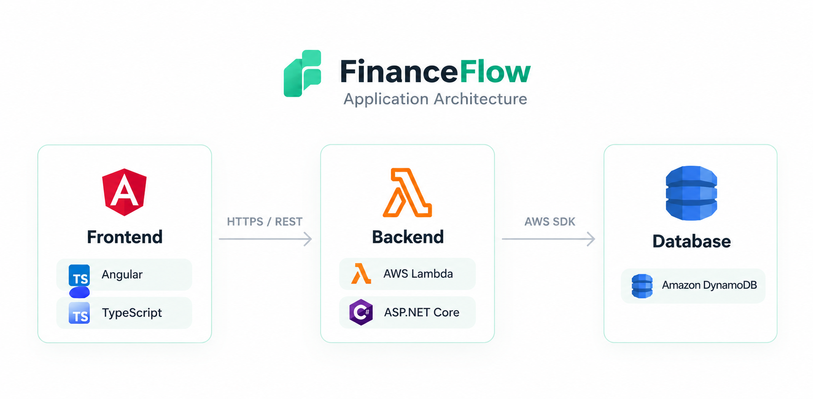

# FinanceFlow 📊

**Personal Finance Management Platform**

A modern personal finance management application designed to help users track income, expenses, and financial activity through an intuitive dashboard.

FinanceFlow combines a responsive Angular interface, a REST API built with ASP.NET Core, and serverless AWS infrastructure to provide a scalable foundation for personal finance management.

> 🚧 **Project status:** In development. The application is being prepared for public deployment. Some features, including authentication, may not yet be implemented.

## ✨ Features

- **Financial dashboard** — Overview of income, expenses, balance, and recent transactions.
- **Transaction management** — Create, view, update, and delete financial transactions.
- **Interactive visualizations** — Charts and financial indicators based on available transaction data.
- **Responsive interface** — Layout designed for desktop and mobile devices.
- **Custom visual identity** — Dark theme, emerald-green accents, and the Fin mascot.
- **Demo mode** — A fallback experience with clearly identified mock data when the API is unavailable or no transactions exist, where implemented.
- **AWS integration** — Serverless API and cloud-based transaction storage.

## 🖥️ Preview

The interface is designed around a modern fintech aesthetic, featuring a dark navy palette, emerald-green highlights, financial summary cards, charts, and a friendly mascot.

**Live demo:** [Open FinanceFlow](https://feature-transactions.d1fwm662ju2u6z.amplifyapp.com)

> The deployment is still being validated. If the demo is unavailable, the hosting configuration may still need adjustment.

## 🏗️ Architecture

<p align="center">
  
</p>

The frontend communicates with the backend through HTTP requests. The backend handles transaction operations and accesses Amazon DynamoDB for persistent storage.

When the API is unavailable, the frontend can use a separate demonstration data source, provided the demo fallback is enabled. Demo data must never be presented as real financial information or sent to the production API.

The frontend communicates with the backend through HTTP requests. The backend handles transaction operations and accesses DynamoDB for persistent storage.

When the API is unavailable, the frontend can use a separate demonstration data source, provided the demo fallback is enabled. Demo data must never be presented as real financial information or sent to the production API.

## 🛠️ Tech Stack

### Frontend
- Angular
- TypeScript
- HTML5
- SCSS
- Angular Router
- Angular HttpClient

### Backend
- C#
- ASP.NET Core
- .NET 8
- REST API

### Cloud & Infrastructure
- AWS Lambda
- Amazon DynamoDB
- AWS Amplify Hosting
- GitHub

### Development & Testing
- Node.js
- npm
- Angular CLI
- Git

## 📂 Project Structure

```text
financeflow/
├── backend/
│   └── FinanceFlow.Api/
│       ├── Controllers/
│       ├── DTOs/
│       ├── Repositories/
│       ├── Services/
│       └── Program.cs
│
├── frontend/
│   ├── public/
│   ├── src/
│   │   └── app/
│   ├── angular.json
│   ├── package.json
│   └── tsconfig.json
│
└── README.md
```

The backend and frontend are maintained in the same repository while remaining independently buildable and deployable.

## 🚀 Getting Started

### Prerequisites

- Node.js compatible with the installed Angular CLI. The project was developed locally with Node.js 24.19.0.
- npm
- .NET 8 SDK
- Git

### 1. Clone the repository

```bash
git clone https://github.com/EstelaAPC/financeflow.git
cd financeflow
```

### 2. Run the backend

```bash
cd backend/FinanceFlow.Api
dotnet restore
dotnet build
dotnet run
```

The API will start at the local URL reported by ASP.NET Core.

The backend configuration determines whether transactions are stored in DynamoDB or an alternative repository. Configure AWS credentials and permissions appropriately when using DynamoDB locally.

### 3. Run the frontend

Open another terminal:

```bash
cd frontend
npm ci
npm start
```

Open `http://localhost:4200` in your browser.

The frontend is configured to communicate with the FinanceFlow API. If you run the backend locally, ensure the API base URL and CORS configuration match your local environment.

## ☁️ Deployment

### Backend

The API is hosted on AWS Lambda using the .NET 8 runtime and connects to Amazon DynamoDB.

### Frontend

The Angular application is prepared for static hosting through AWS Amplify. The deployment configuration must use the `frontend` directory as the monorepo application root and the actual Angular production output directory as its artifact directory.

Build the frontend locally with:

```bash
cd frontend
npm run build
```

The current local build output is:

```text
frontend/dist/frontend
```

The production hosting deployment is still being validated.

## 🔌 API Endpoints

The backend exposes transaction endpoints under `/api/Transactions`.

| Method | Endpoint | Purpose |
|---|---|---|
| GET | `/api/Transactions` | Retrieve transactions |
| GET | `/api/Transactions/{id}` | Retrieve a transaction by ID |
| POST | `/api/Transactions` | Create a transaction |
| PUT | `/api/Transactions/{id}` | Update a transaction |
| DELETE | `/api/Transactions/{id}` | Delete a transaction |

The deployed API base URL is configured separately from the frontend source code.

## 🔐 Security Notes

- Do not commit AWS access keys, passwords, or other secrets.
- The current API Function URL has been configured for public access during development.
- Authentication and authorization must be implemented before handling real personal financial data.
- Use fictional information while the API remains publicly accessible.
- Demo transactions should remain isolated from production API operations.

## 🗺️ Roadmap

- [x] Create the .NET REST API.
- [x] Integrate transaction storage with Amazon DynamoDB.
- [x] Deploy the API to AWS Lambda.
- [x] Create the Angular frontend project.
- [x] Implement the initial frontend and production build.
- [ ] Complete and validate public frontend deployment.
- [ ] Finish dashboard data loading and error handling.
- [ ] Validate demo-mode fallback behavior.
- [ ] Improve automated tests and accessibility.
- [ ] Implement authentication and authorization.
- [ ] Add further financial reports and insights.

## 👩‍💻 Author

**Estela Argolo**

Computer Engineering graduate interested in software engineering, cloud computing, frontend architecture, and building practical technology products.

- GitHub: [@EstelaAPC](https://github.com/EstelaAPC)

---

*FinanceFlow — Understand your money. Take control of your future.*
